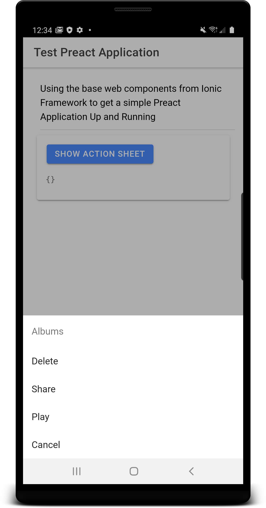

# Capacitor Application Running Preact with Ionic Framework Web Components

## Whats This Is...
This was just a basic test to get it working, I am certain there are some optimizations... currently I am loading the ionic libraries in the index html, and having issues with packaging for production builds.

Have done much to test the routing, but the controller access is demonstrated with the actionsheet and the Ionic Styles are comming through which can be seen based on the screenshots

This is really just a test to show that the ionic web-components can work with javascript based frameworks, for the most part, I am certain there will be some potential gotchas, but hey it is a great set of components and they are just getting started

## Whats Working So Far
- running in web browser using default commands
- running from local host for live-reload, see capacitor.config.json
- cannot make a production build because of some error with Uglify, removed it from the build process
- have to turn off pre-rendering in the build, see package.json script modification

